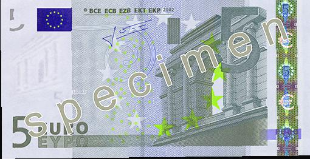
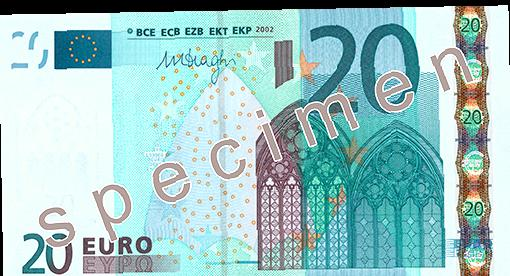
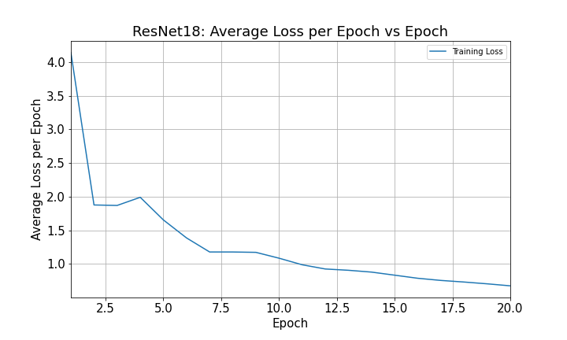
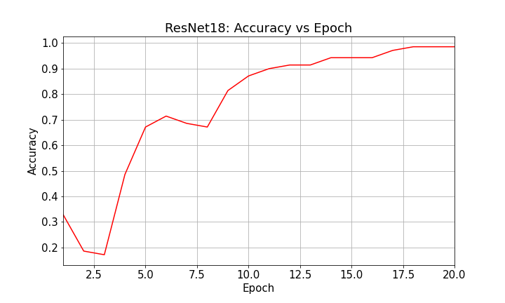
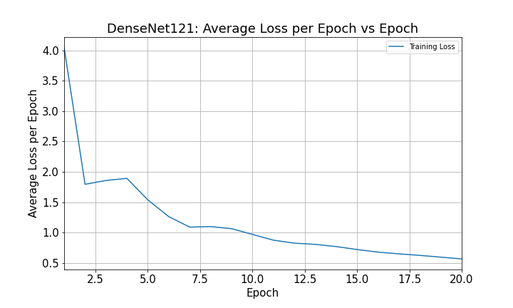
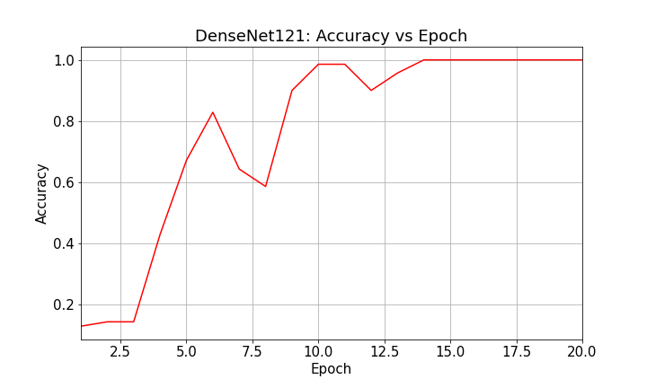

# European banknotes classification using pre-trained ResNet18 and DenseNet121
This repository contains an example use of pretrained networks available on PyTorch.

### Models
Following two pretrained models were compared for image classification task:
1. ResNet-18 model from [Deep Residual Learning for Image Recognition](https://arxiv.org/pdf/1512.03385.pdf).
2. DenseNet-121 model from [Densely Connected Convolutional Networks](https://arxiv.org/abs/1608.06993).
### Datasets
European sample banknote datasets can be downloaded from the following links:
```
train_csv_file = 'https://cocl.us/DL0320EN_TRAIN_CSV'
validation_csv_file = 'https://cocl.us/DL0320EN_VALID_CSV'
test_csv_file = 'https://cocl.us/DL0320EN_TEST_CSV'
```
#### Example dataset looks like:





### Results:

#### ResNet18
This model reached peak accuracy of **0.985** with 20 epochs.





#### DenseNet121
This model reached peak accuracy of **1.0** with 20 epochs.
Though it should be mentioned that it reached better accuracy than ResNet18 with first 10 epochs.





### Conclusions

DenseNet121 is better classifier for image recognition task, though it takes longer to train the pretrained model.

##### Disclaimer: This code is based on the capstone project from IBM Deep Learning professional course on edX.